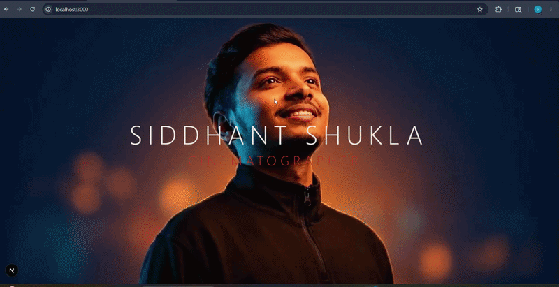

# Cinematic Portfolio

A high-end, cinematic web portfolio built to showcase creative work with stunning visuals, smooth scroll animations, and a modern aesthetic.


The animation below showcases the complete cinematic experience of the portfolio website.

<p align="center">
  
</p>

---

## 🚀 Technologies Used

- **Framework:** [Next.js 15](https://nextjs.org/) (App Router)
- **Styling:** [Tailwind CSS 4](https://tailwindcss.com/)
- **Animations:** [Framer Motion](https://www.framer.com/motion/)
- **Icons:** [Lucide React](https://lucide.dev/)
- **Video:** [React YouTube](https://github.com/tjallingt/react-youtube)
- **Language:** TypeScript

## ✨ Features

- **Cinematic Design:** Dark-mode oriented, minimalist, and premium visual hierarchy.
- **Smooth Animations:** Scrollytelling elements and dynamic page transitions using Framer Motion.
- **Interactive Galleries:** Hover-triggered reveal effects and integrated YouTube videos.
- **Responsive Layout:** Optimized for mobile, tablet, and desktop views.

## 🛠️ Getting Started

First, install dependencies:

```bash
npm install
```

Then, run the development server:

```bash
npm run dev
```

Open [http://localhost:3000](http://localhost:3000) with your browser to see the result.

## 📁 Project Structure

- `src/app/` - Next.js App Router pages and layouts.
- `src/components/` - Reusable React components (UI elements, animated sections, etc.).
- `public/` - Static assets.

## 📝 License

This project is open-source and available under the [MIT License](LICENSE).
